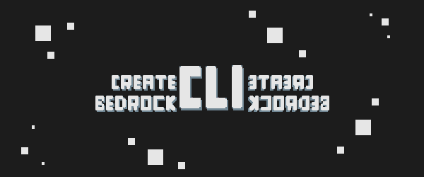

# Create MC Bedrock CLI

<div align="center">

[](https://www.npmjs.com/package/create-mc-bedrock)
[](https://www.npmjs.com/package/@keyyard/bedrock-build)
[](https://github.com/keyyard/create-mc-bedrock-cli)

[](https://nodejs.org/)
[](LICENSE)
[](https://discord.gg/EJ4swPKJNU)
[](https://bedrockcli.keyyard.xyz/)

<br/>



</div>

**The fastest way to start a Minecraft Bedrock addon. Three sources, one command, zero boilerplate.**

---

## What's new in 2.0

- **Three sources** — Custom Workspace (recommended), Microsoft Official Samples, Community Templates.
- **Bundled Custom Workspace** powered by [`@keyyard/bedrock-build`](https://www.npmjs.com/package/@keyyard/bedrock-build) — TypeScript bundling, hot-reload deploy to local Minecraft, one-shot `.mcaddon` packaging.
- **Pinned dependencies** — the scaffolder queries the npm registry and writes resolved versions into your `package.json`, so every new project starts on current-stable `@minecraft/server`.
- **Auto-install prompt** after scaffold.

## Quick start

```bash
npx create-mc-bedrock
```

You'll be asked for:

1. **Source** — pick one of three:
   - **Custom Workspace (recommended)** — bundled, ships with the `bedrock-build` compiler (hot reload, deploy, `.mcaddon` pack).
   - **Microsoft Official Samples** — cloned from [`microsoft/minecraft-scripting-samples`](https://github.com/microsoft/minecraft-scripting-samples).
   - **Community Templates** — cloned from [`Keyyard/custom-mc-scripting-templates`](https://github.com/Keyyard/custom-mc-scripting-templates).
2. **Project name** — used for `bedrock.config.json`, `package.json`, and manifest headers.
3. **Destination folder** — defaults to `./<project-name>`.
4. (After scaffold) **Install dependencies now?** — `y` to run `npm install`, `n` to skip.

Manifest UUIDs are regenerated for every scaffold and BP↔RP dependency UUIDs are kept consistent.

## Custom Workspace at a glance

```
my-addon/
  bedrock.config.json
  package.json
  tsconfig.json
  src/
    main.ts                ← entry — bundled into BP/scripts/main.js
  packs/
    BP/  manifest.json + behavior pack files
    RP/  manifest.json + resource pack files
  dist/                    ← build output (gitignored)
```

Useful scripts the scaffolder writes for you:

```bash
npm run build           # dev build
npm run watch           # rebuild on save
npm run deploy          # build + copy to local Minecraft
npm run deploy:watch    # hot reload to local Minecraft
npm run pack            # release build + zip into .mcaddon
npm run release         # release build only
```

See the full [`bedrock.config.json` reference](https://bedrockcli.keyyard.xyz/docs) for compiler options.

## Requirements

- Node.js 18 or higher.
- Windows for `deploy` retail (custom deploy paths work everywhere). Mac/Linux retail deploy is on the roadmap.

## Contributing

Want to add a Community Template? Open a PR against [`Keyyard/custom-mc-scripting-templates`](https://github.com/Keyyard/custom-mc-scripting-templates).

Found a bug in the scaffolder or compiler? File an issue here or join the [Discord](https://discord.gg/EJ4swPKJNU).

## Credits

- **Beyond64** ([OsmaanGani](https://github.com/OsmaanGani)) — package banner artist
- **PottedPropagule** ([PottedPropagule](https://github.com/PottedPropagule)) — issue reporter and helpful feedback

## ⭐ Stargazers Over Time

<a href="https://www.star-history.com/#Keyyard/create-mc-bedrock-cli&Date">
 <picture>
   <source media="(prefers-color-scheme: dark)" srcset="https://api.star-history.com/svg?repos=Keyyard/create-mc-bedrock-cli&type=Date&theme=dark" />
   <source media="(prefers-color-scheme: light)" srcset="https://api.star-history.com/svg?repos=Keyyard/create-mc-bedrock-cli&type=Date" />
   
 </picture>
</a>

<div align="center">
  Made for the Minecraft Bedrock dev community.
  <br/>
  <a href="https://github.com/keyyard/create-mc-bedrock-cli/stargazers">⭐ Star us on GitHub</a>
</div>
