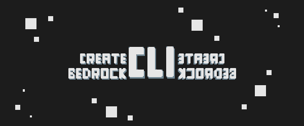

# Create MC Bedrock CLI

<div align="center">

[](https://github.com/keyyard/create-mc-bedrock-cli)

[](https://nodejs.org/)
[](LICENSE)
[](https://discord.gg/EJ4swPKJNU)
[](https://bedrockcli.keyyard.xyz/)

<br/>



</div>

**The fastest way to start a Minecraft Bedrock addon. One clean starter, then scaffold content with a single command.**

---

## Bedrock CLI 3.0 — the generator release

No more picking a template.

You scaffold one clean starter, then build content with `create:*` generators.

## Quick start

```bash
npx create-mc-bedrock
```

You'll be asked for:

1. **Project name** — used for `bedrock.config.json`, `package.json`, and manifest headers.
2. **Destination folder** — defaults to `./<project-name>`.
3. (After scaffold) **Install dependencies now?** — `y` to run `npm install`, `n` to skip.

Manifest UUIDs are regenerated for every scaffold and BP↔RP dependency UUIDs are kept consistent.

## New `create:*` generators (run inside your project)

```bash
npm run create:weapon   # 2D or 3D, default behavior stats, auto-builds item + attachable
npm run create:tool     # pickaxe / axe / shovel / hoe picker
npm run create:armor    # helmet/chest/legs/boots, icon-only or 3D
npm run create:item     # basic item with texture
npm run create:entity   # basic entity with geo + texture
npm run create:block    # basic block with texture
```

Every command writes all linked files for you:

- Behavior + resource JSON
- Texture atlas entries
- Language entries

All registrations are handled automatically.

- **Safe to re-run** (idempotent)
- Supports `--dry-run` so you can preview changes before writing files

For custom generator assets, import your own model/animation/texture first; the generator wires references for you.

## Starter workspace at a glance

```
my-addon/
  bedrock.config.json
  package.json
  tsconfig.json
  src/
    main.ts                ← entry — bundled into BP/scripts/main.js
  packs/
    BP/  manifest.json + behavior pack files
    RP/  manifest.json + resource pack files
  dist/                    ← build output (gitignored)
```

Useful scripts the scaffolder writes for you:

```bash
npm run build           # dev build
npm run watch           # rebuild on save
npm run deploy          # build + copy to local Minecraft
npm run deploy:watch    # hot reload to local Minecraft
npm run pack            # release build + zip into .mcaddon
npm run release         # release build only
```

See the full [`bedrock.config.json` reference](https://bedrockcli.keyyard.xyz/docs) for compiler options.

## Repositories + links

- **CLI (main):** https://github.com/Keyyard/create-mc-bedrock-cli
- **`@keyyard/bedrock-build` (compiler):** https://github.com/Keyyard/bedrock-build
- **Website:** https://bedrockcli.keyyard.xyz/
- **Docs:** https://bedrockcli.keyyard.xyz/docs

## Requirements

- Node.js 18 or higher.
- Windows for `deploy` retail (custom deploy paths work everywhere). Mac/Linux retail deploy is on the roadmap.

## Contributing

Want to add a Community Template? Open a PR against [`Keyyard/custom-mc-scripting-templates`](https://github.com/Keyyard/custom-mc-scripting-templates).

Found a bug in the scaffolder or compiler? File an issue here or join the [Discord](https://discord.gg/EJ4swPKJNU).

## Credits

- **Beyond64** ([OsmaanGani](https://github.com/OsmaanGani)) — package banner artist
- **PottedPropagule** ([PottedPropagule](https://github.com/PottedPropagule)) — issue reporter and helpful feedback

## ⭐ Stargazers Over Time

<a href="https://www.star-history.com/#Keyyard/create-mc-bedrock-cli&Date">
 <picture>
   <source media="(prefers-color-scheme: dark)" srcset="https://api.star-history.com/svg?repos=Keyyard/create-mc-bedrock-cli&type=Date&theme=dark" />
   <source media="(prefers-color-scheme: light)" srcset="https://api.star-history.com/svg?repos=Keyyard/create-mc-bedrock-cli&type=Date" />
   
 </picture>
</a>

<div align="center">
  Made for the Minecraft Bedrock dev community.
  <br/>
  <a href="https://github.com/keyyard/create-mc-bedrock-cli/stargazers">⭐ Star us on GitHub</a>
</div>
